# io_artiste (en)

### Node List

- **operator** : primary and/or essential nodes for launching the test(s)
- **mode** : launches the different existing game modes
- **debug** : debug and additional options

---
|Node|Category|Image|Description|
|:---:|:---:|:---:|:---:|
|Init|operator|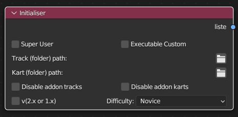|is the starting point of the node tree|
|CLI|operator|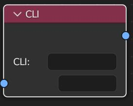|is a node that works like a terminal|
|Go Run Test|operator|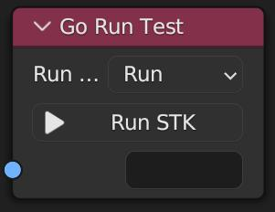|is the node that executes the node tree (terminal command)|
|Preview CMD|debug|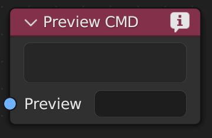|is a command preview node|
|Direct Run|operator|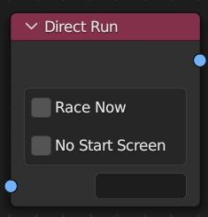|a node that enables direct track launch without going through the menu and also disables the countdown at start|
|Racing|mode|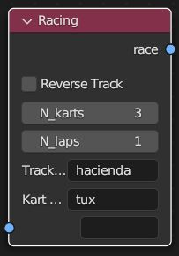|the racing track test node|
|Battle|mode|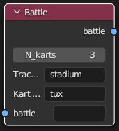|the battle track test node|
|Soccer|mode|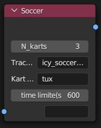|the Soccer (Football) track test node|
|Demo|mode|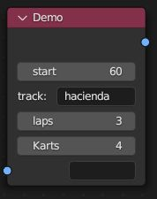|the node that launches demo mode (race)|
---

## Init Node
- **SuperUser** : allows running a command as administrator (not available on Windows; open directly in administrator mode for similar behavior)
- **Password (if SuperUser checked)** : your personal password.

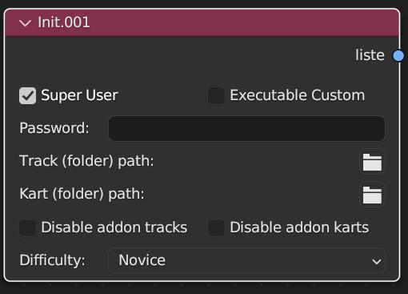
- **Custom Executable** : enables the choice of a custom executable.
- **Game (file) path (if Custom Executable checked)** : use an STK executable other than the one installed on the system.

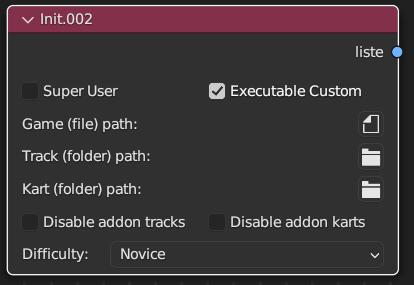
- **Track (folder) path** : load your own "Track/Battle/Soccers" folder.
- **Kart (folder) path** : load your own "Kart" folder.
- **Disable addon tracks** : if enabled, does not load the "Tracks/Battle/Soccers" addons downloaded from the game.
- **Disable addon karts** : if enabled, does not load the "Karts" addons downloaded from the game.
- **v(2.x or 1.x)** : Allows you to adjust the command depending on whether you want to use SupertuxKart 1.x or SuperTuxKart Evolution (2.x) 
- **Difficulty** : choose a difficulty level (Novice/Intermediate/Expert/SuperTux) if v(2.x or 1.x) is true a new additional difficulty is available.

When used, it is always at the start of the node tree.

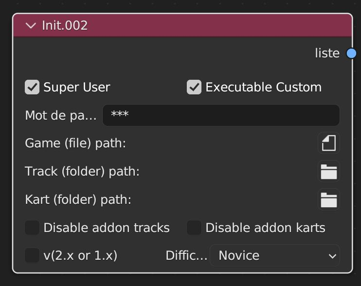

## CLI Nodes

Should be treated as a terminal.

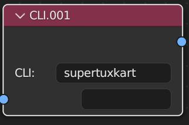

Can be chained together for a cleaner visual layout.

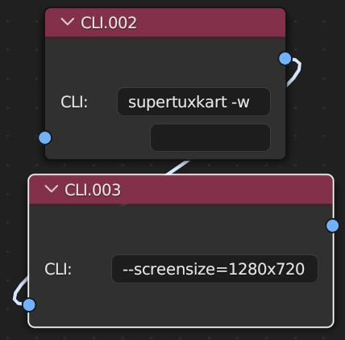

## Go Run Test Nodes

Is the only truly mandatory node since it launches the execution of the command built with the node tree.
- **Run** : launches the command from Blender (blocks the Blender user interface).
- **Popen** : launches the command independently of Blender (does not block the Blender user interface).

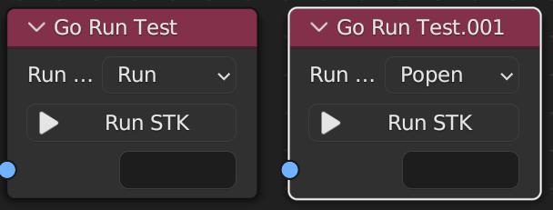

It is always placed at the end of the node tree, it can also be used alone and contain the complete command without using other nodes.

## Preview CMD Nodes

This node allows you to preview the command(s) built in the node tree, which can be useful to ensure the correct command is launched by checking the selected options.

It can display long commands over multiple lines.

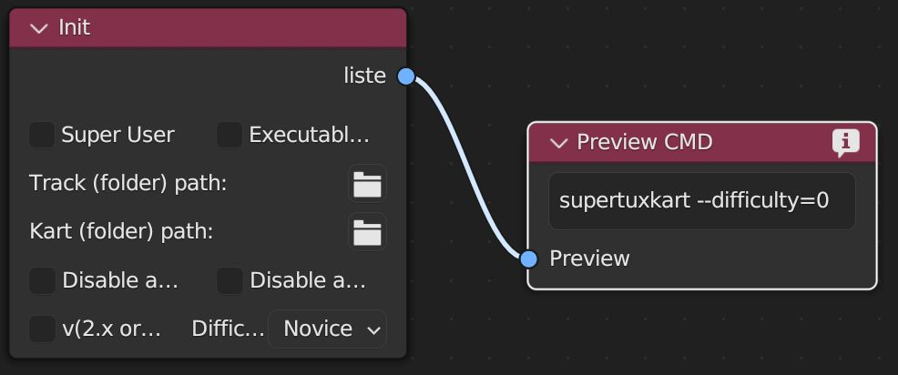
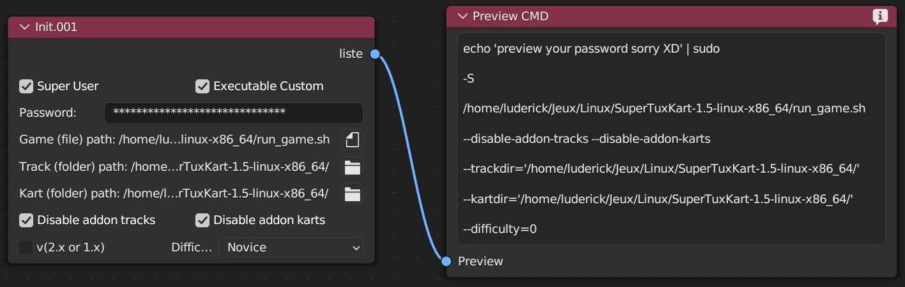
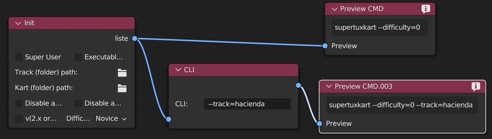

## Direct Run Node

Launch your track directly

- **Race Now** : starts the track directly in the chosen mode without the start countdown
- **No Start Screen** : starts the track directly in the chosen mode

## Racing Node
Launches the game in Racing mode (to be used with the *Direct Run* node)

- **Reverse Track** :  launch the track in reverse direction
- **N_karts** :  number of karts present
- **N_laps** :  number of laps
- **Track Choice** :  the track to launch
- **Kart User** :  the user's kart

## Battle Node
Launches the game in Battle mode (to be used with the *Direct Run* node)

- **N_karts** :  number of karts present
- **Track Choice** :  the track to launch
- **Kart User** :  the user's kart

## Soccer Node
Launches the game in Soccer (Football) mode (to be used with the *Direct Run* node)

- **N_karts** :  number of karts present
- **Track Choice** :  the track to launch
- **Kart User** :  the user's kart
- **time limit(s)** :  the game time in seconds

## Demo Node
Launches demo mode at the start menu

- **start** : time in seconds before demo mode launches
- **track** : is a list of tracks that will be played in demo mode in the order they are written, e.g. (minigolf,hacienda) - all must be written together, in one go
- **laps** : number of laps
- **Karts** : number of karts (bots)

### Nodes can be linked to each other without issue

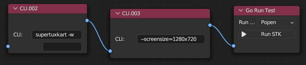
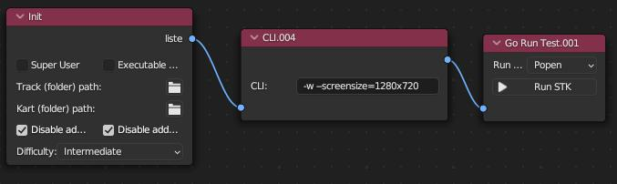
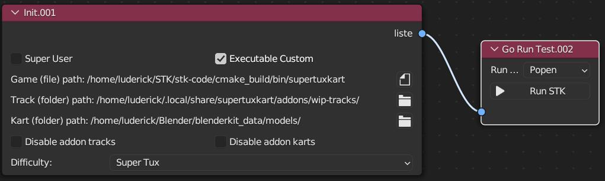

---
### [back to home](./../doc_io_artiste.md)
